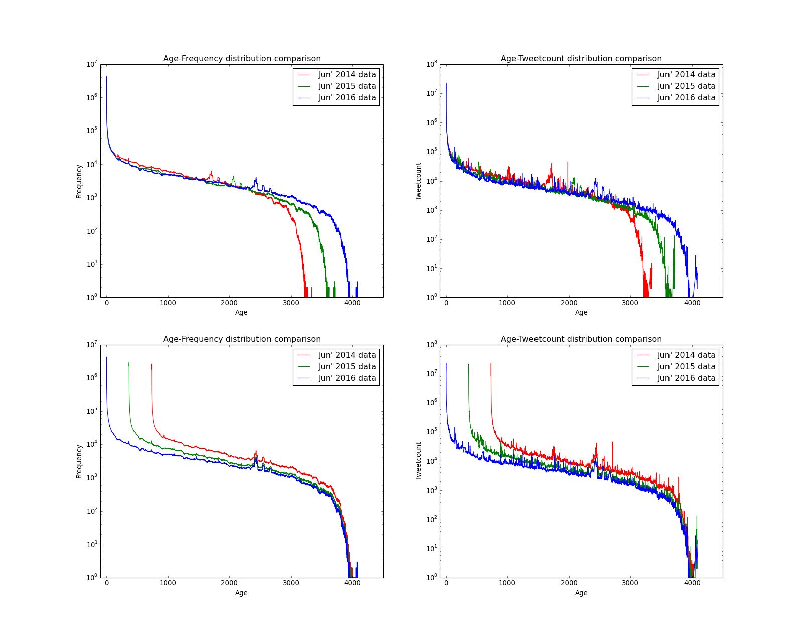
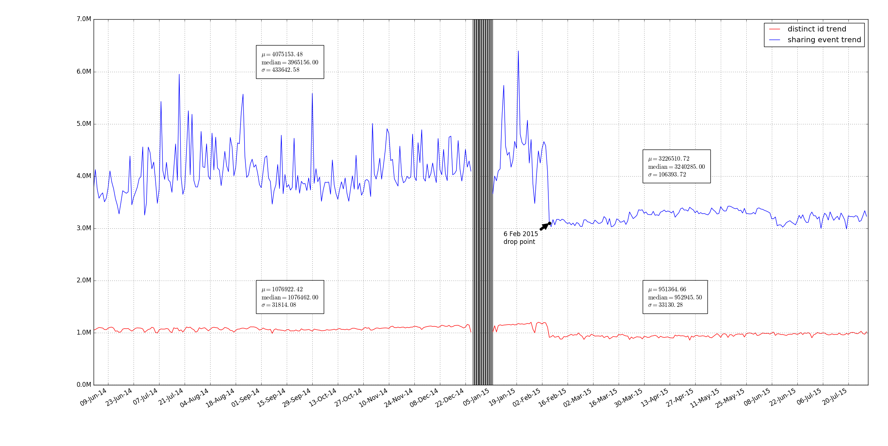
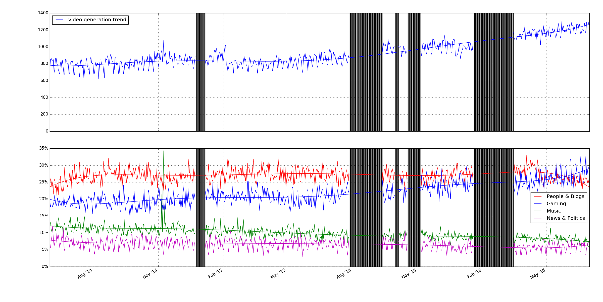
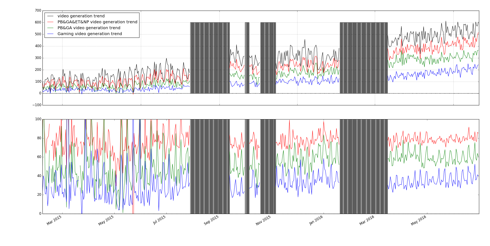

# yt-longevity wiki

## Table of Contents

  * [Frequent Asked Questions](#yt-longevity-wiki)
    * [Data](#data)
    * [How do we measure missing data?](#)
    * [Does YouTube become popular over the years?](#)
    * [How does YouTube calculate view/share?](#)
    * [Emerging videos dill in](#)
    * [Granger causality to model hidden factors](#)
    * [Rebound effect of later publish](#)

## Data

* ~~buy some data from GNIP to validate our querying that may be subject to API rate limits~~

### June dataset

June data populated from twitter streaming with 1 year apart
* long-lived 1 -- at least one day w >50 tweets, and at least 500 days old
* long-lived 2 -- at least one day w >200 tweets, and at least 500 days old

| Dataset           | Tweet       | Sharing    | LLived1 | LLived2|
| ----------------- |:-----------:| ----------:| -------:| ------:|
| Jun' 2014 dataset | 114,186,367 | 25,547,102 | 17,898  | 2,591  |
| Jun' 2015 dataset | 99,782,726  | 24,360,550 | 10,901  | 17,10  |
| Jun' 2016 dataset | 97,415,267  | 28,230,253 | 10,378  | 16,35  |

## Temporal tweeting/viewing behavior comparison

## How do we measure missing data?

## ~~Does YouTube become creative over the years?~~

## ~~Emerging videos dill in~~

* Are gaming videos growing more than other categories? [yes] what led to the growth, pokemon?
* how has the composition of categories changes between 2014 and 2016?

What are those emerging videos? Are they predominant Gaming videos? What are those Gaming videos? Are they long-lived games or new ones like Pokemon Go?

## Longlived video analysis
* "long-lived videos" contain disproportionally more music videos -- (1) quantify exactly how many (2) explain why this is the case (3) quantify how long any other video category survive.

| Year                  | 2014 | 2015 | 2016 | 2014   | 2015   | 2016   |
| --------------------- | :---:| ----:| ----:| :-----:| ------:| ------:|
| Music                 | 880  | 634  | 442  | 0.3396 | 0.3707 | 0.2703 |
| People & Blogs        | 528  | 231  | 251  | 0.2037 | 0.1350 | 0.1535 |
| News & Politics       | 307  | 145  | 249  | 0.1184 | 0.0848 | 0.1522 |
| Entertainment         | 134  | 184  | 134  | 0.0517 | 0.1076 | 0.0819 |
| Education             | 134  | 189  | 110  | 0.0517 | 0.1105 | 0.0672 |
| Sports                | 126  | 52   | 56   | 0.0486 | 0.0304 | 0.0342 |
| Film & Animation      | 118  | 45   | 52   | 0.0455 | 0.0263 | 0.0318 |
| Comedy                | 107  | 55   | 78   | 0.0412 | 0.0321 | 0.0477 |
| Nonprofits & Activism | 92   | 63   | 100  | 0.0355 | 0.0368 | 0.0611 |
| Howto & Style         | 48   | 50   | 102  | 0.0185 | 0.0292 | 0.0623 |
| Science & Technology  | 40   | 35   | 10   | 0.0154 | 0.0204 | 0.0061 |
| Autos & Vehicles      | 27   | 1    | 5    | 0.0104 | 0.0006 | 0.0030 |
| Travel & Events       | 24   | 7    | 1    | 0.0092 | 0.0041 | 0.0006 |
| Pets & Animals        | 16   | 8    | 34   | 0.0061 | 0.0047 | 0.0207 |
| Gaming                | 8    | 7    | 8    | 0.0030 | 0.0041 | 0.0048 |
| Shows                 | 2    | 4    | 3    | 0.0007 | 0.0023 | 0.0018 |
| Total                 | 2591 | 1710 | 1635 | 1.0000 | 1.0000 | 1.0000 |

* old videos don't die -- which videos are forgotten between 2014 and 2016, and which ones was 'revived'

* tweet bots that promote videos -- (1) Hyptothesis: bot activity does not increase viewcount (1.1) identify some bots, or bot-generated tweets, systematically (1.2) plot (#bot-tweets) vs viewcount.  (0) how prevalent is bot-tweets for (some) youtube videos?

## measuring change in viewing behavior over time

* has total attention (in terms of viewcount) increased? to which categories?

## Granger causality to model hidden factors

## Rebound effect of later publish

Can later publish promote previous publish?
