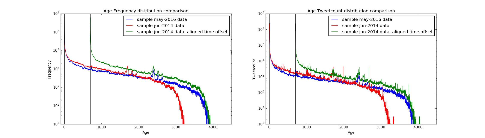

# yt-longevity wiki

## Table of Contents

  * [Frequent Asked Questions](#yt-longevity-wiki)
    * [Data](#data)
    * [How do we measure missing data?](#)
    * [Does YouTube become popular over the years?](#)
    * [How does YouTube calculate view/share?](#)
    * [Emerging videos dill in](#)
    * [Granger causality to model hidden factors](#)
    * [Rebound effect of later publish](#)

## Data

### buy some data from GNIP to validate our querying that may be subject to API rate limits

### 10% Monthly dataset

10% Sample ratio from June-2014 and May-2016 tweets dataset.
- 10% June dataset:
- 10% May dataset: 242758560 tweets, 3706190 distinct youtube videos are mentioned. 3421278 of those can retrieve a useful metadata.

## How do we measure missing data?

## Does YouTube become popular over the years?

## Emerging videos dill in

* Are gaming videos growing more than other categories? [yes] what led to the growth, pokemon?
* how has the composition of categories changes between 2014 and 2016?

What are those emerging videos? Are they predominant Gaming videos? What are those Gaming videos? Are they long-lived games or new ones like Pokemon Go?

## Temporal tweeting/viewing behavior comparison

* old videos don't die -- which videos are forgotten between 2014 and 2016, and which ones was 'revived'

* "long-lived videos" contain disproportionally more music videos -- (1) qunatify exactly how many (2) explain why this is the case (3) quantify how long any other video category survive. 
* tweet bots that promote videos -- (1) Hyptothesis: bot activity does not increase viewcount (1.1) identify some bots, or bot-generated tweets, systematically (1.2) plot (#bot-tweets) vs viewcount.  (0) how prevalent is bot-tweets for (some) youtube videos?

## measuring change in viewing behavior over time

* has total attention (in terms of viewcount) increased? to which categories?

## Granger causality to model hidden factors

## Rebound effect of later publish

Can later publish promote previous publish?
